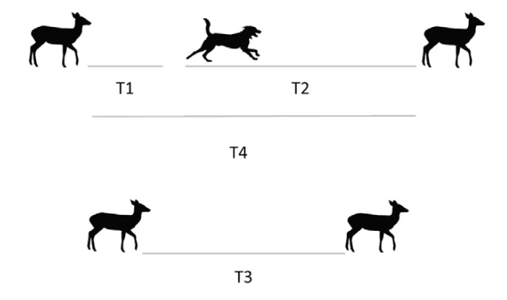

# AvoidAttract

<!-- badges: start -->
<!-- badges: end -->

Avoidance-Attraction Ratios from a time series of detections in Program R

## Introduction

Investigates the temporal avoidance or attraction of species using the time between detections of species A and species B.


### Functions

* The T1 (AB) function analyzes camera trapping data to calculate the time between the detections of species A followed by species B.

* The T2 (BA) function analyzes camera trapping data to calculate the time between the detections of species B followed by species A given that a T1 (AB) event occurred.

* The T3 (AA) function analyzes camera trapping data to calculate the time between the detections of species A followed by species A without species B inbetween detections.

* The T4 (ABA) function analyzes camera trapping data to calculate the time between detections of species A, with a detection of species B inbetween the detections of species A.

* The AAR function calculates the T1, T2, T3 and T4 events as well as the T2/T1 (BA/AB) and T4/T3 (ABA/AA) ratios.




#### Note 

From Parsons et al. 2016:

The T2/T1 (BA/AB) ratio could be influenced both by the avoidance of the species A and the attraction of species B

The T4/T3 (ABA/AA) ratio is influenced solely by the avoidance of the species B by species A.

Values >1 for T2/T1 or T4/ T3 suggest nonrandom movement between the two species indicating that the species A is avoiding the area after the passage of species B. Attraction of species B to species A could also result in high T2/T1 ratios, but would result in lower ratios of T4/T3.


For more information on Attraction-Avoidance Ratios please see references.

### References

Parsons, A. W., C. Bland, T. Forrester, M. C. Baker-Whatton, S. G. Schuttler, W. J. McShea, R. Costello, and R. Kays. 2016. The ecological impact of humans and dogs on wildlife in protected areas in eastern North America. Biological Conservation 203:75–88.

Niedballa, J., A. Wilting, R. Sollmann, H. Hofer, and A. Courtiol. 2019. Assessing analytical methods for detecting spatiotemporal interactions between species from camera trapping data. M. Rowcliffe and J. Ahumada, editors. Remote Sensing in Ecology and Conservation 5:272–285.

Naidoo, R., and A. C. Burton. 2020. Relative effects of recreational activities on a temperate terrestrial wildlife assemblage. Conservation Science and Practice 2:e271.

### Installation

You can install the development version of AvoidAttract from [GitHub](https://github.com/) with:

``` r
# If needed
install.packages("devtools")

# Install AvoidAttract
devtools::install_github("dpearcetamu/AvoidAttract")
```

### Example

This is an example of how to implement the AvoidAttract package using the AAR function on camera trapping data

``` r
# Loading package
library(AvoidAttract)

# Calling camera trapping data
data("KScams_dat")

# Quick look
head(KScams_dat)

# Formating DateTime column, critical for the functions to work
KScams_dat$DateTime  <- as.POSIXct(KScams_dat$DateTime ,  tryFormats = "%m/%d/%Y %H:%M:%OS")

# Using the AAR function to investigate white-tailed deer and coyote interactions
AAR_example <- AAR(data = KScams_dat, speciesA = "White-Tailed Deer", speciesB = "Coyote",
                   species_col = "Common_name", datetime_col = "DateTime", site_col ="Site", unitTime = "hours")
                   
# Here is the overal summary                    
AAR_example$total_summary

# and the total event counts
AAR_example$event_count

# Here is what everything looks like broken down by site
head(AAR_example$site_summary)

```

